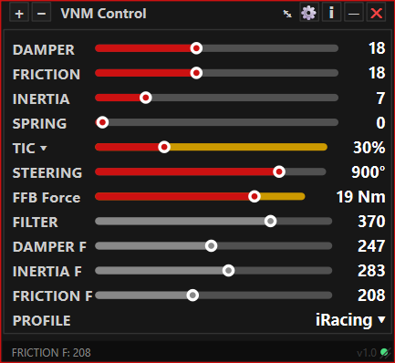

# VNM Control

VNM Control is a free real-time FFB tuning overlay for VNM sim racing bases. Instead of alt-tabbing to adjust force feedback settings mid-session, it puts a live HUD directly on your screen so you can monitor and change all FFB parameters without ever leaving the game.

---

## Screenshots

**Main Window**

---

## Features

VNM Control connects to VNM SimCenter via its REST API and gives you full control over your FFB parameters in real time. You can map any parameter to hotkeys on your wheel or button box, so adjustments happen instantly without touching the mouse or keyboard.

The overlay is fully customizable — you choose which fields to display, where the HUD sits on screen, its size and opacity. If you run multiple monitors it will position itself automatically on whichever screen you set.

Game profiles let you save different FFB configurations per title. When a supported game is detected, the right profile loads automatically so you are always starting with your preferred settings.

Preset management lets you save, load and reset full FFB configurations at any time, making it easy to experiment and roll back if something doesn't feel right.

---

## Requirements

- Windows 10 or 11 (64-bit)
- VNM SimCenter with REST Server enabled

To enable the REST Server, open SimCenter and go to General settings (⚙). The toggle is there — default address is `http://localhost:9000`. VNM Control will not connect without it.

---

## Installation

1. Download the latest release from the [Releases](../../releases/latest) page
2. Extract the zip anywhere on your PC
3. Run `VNM Control.exe` — no installer needed

The first time it runs, a `VNMControl.ini` configuration file will be created in the same folder. All your settings, hotkeys and presets are stored there.

> **Note:** The executable does not have a custom icon yet. Windows will show a generic icon — this is expected and does not affect functionality.

---

## Configuration

All settings are accessible from within the app. For advanced users, the `VNMControl.ini` file can be edited directly — it is a standard INI file with clearly labelled sections for general settings, hotkeys, UI fields and presets.

---

## Known Issues

- Requires VNM SimCenter with the REST Server enabled (beta UI)
- No custom exe icon in v1.0

---

## Feedback and Support

This is v1.0 and a personal project built by a sim racer for sim racers. If you find a bug, have a feature request or just want to share feedback, open an [Issue](../../issues) on this repository or reach out directly.

---

## License

Free to use for personal, non-commercial use. Do not redistribute modified versions without credit.
